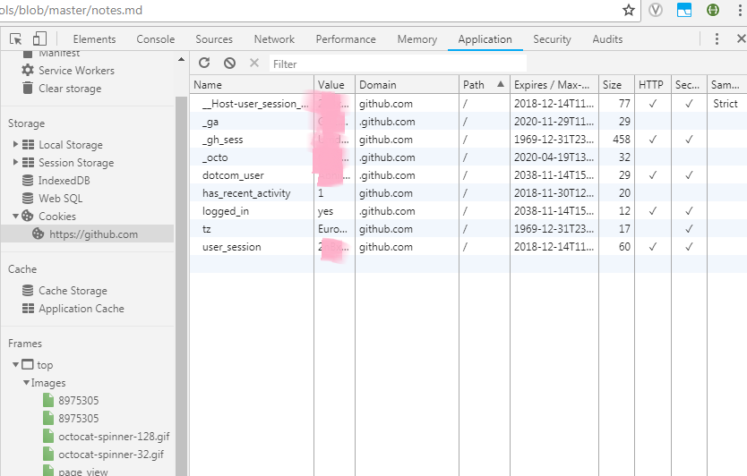
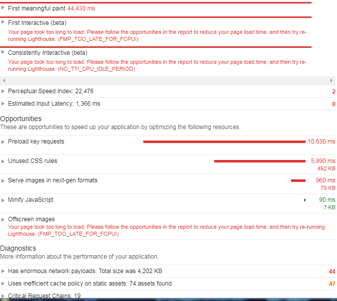
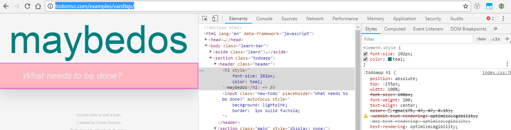

Chrome DevTools
================
Understanding how to use Chrome Developer Tools to inspect, trouble shoot, optimize web sites.

## Opening DevTools
- Menu -> More tools -> Developer tools
- Right+Click on page element -> inspect
- (Accel Key) Ctrl + Shift + I
- (Shortcut Key) F12 
## Overview of Capabilities
- Elements
    - Inspect and Edit HTML elements
    - We can use _'Select an element on page to inspect' (Ctrl + Shift + C)_ to highlight HTML for selected in the page!
- Console
    - Write JS code here, or see output from JS console here
    - Also see error messages
    - Note we have programatic access to the running DOM and JS environment from here. e.g.
    ```javascript
    > document.getElementByTagName('p');
    ```  
    _This will return an array of HTML elements with the paragraph tag_.  
    We can even write multiline snippets of code using _'Shift+Enter'_
- Sources
    - View the source code (& assets) on the server side
    - An example might look like -  
  
    - Use the '{}' _prettify_ button to make minified source readable
- Network
    - Shows all the network requests with the details such as _Resource Name_, _HTTP Status_, _Size_, _Initiator of request_, _Waterfall View_ etc.
    - This is very helpful for identifying network related performance issues
- Performance
    - View performance characteristics
- Memory
    - View memory utilization, leaks etc.

_Performance & Memory are used to analyze and optimize performance_
- Application
    - Enables us to view the inetrnals of our application (client side)
    - It shows information such as _local storage_, _cahce_, _cookies_ etc.
    - An example would be -  

    - We can even modify the _cookies_ from here!
- Security
    - This view gives security related details such as _Certificate_, _Connection_ (TLS), _Resources_ etc.
- Audit
    - This is a very handy tool that can do an audit of the web page to identify _Performance_, _Accessibility_, _Best Practices_ etc.
    - An example for a page is shown below 

_This analysis lists the audit report and the opportunities for improvement. As we can see it is quite comprehensive and can can help narrow down areas to focus_

## Dive Deeper
### Inspect & Modify a page live
In order to do that we can use a very handy website **todomvc.com**.  
We can go to this site and _inspect_ and _modify_ elements using the _Elements_ tab. We can use this to play around with the page. This modifies the DOM as we manipulate it and we can see the changes to the brwoser page.  
A sample of modifying the elements on the fly is shown - 
  
_We can change the element values or attributes, style etc._


