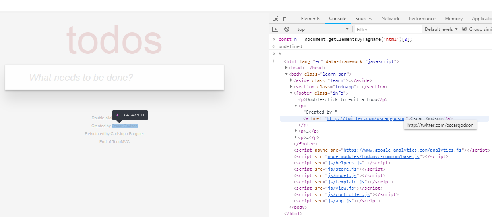
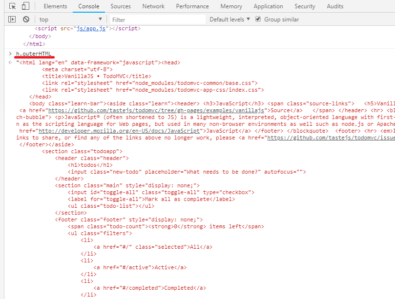
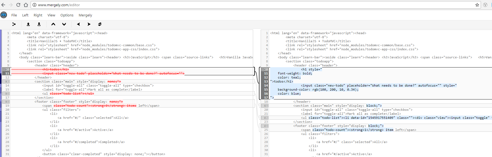
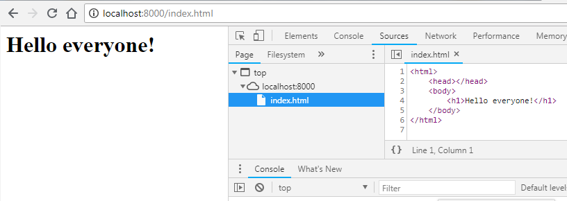

Chrome DevTools
================
Understanding how to use Chrome Developer Tools to inspect, trouble shoot and optimize web sites.

## Opening DevTools
- Menu -> More tools -> Developer tools
- Right+Click on page element -> inspect
- (Accel Key) Ctrl + Shift + I
- (Shortcut Key) F12 
## Overview of Capabilities
- Elements
    - Inspect and Edit HTML elements
    - We can use _'Select an element on page to inspect' (Ctrl + Shift + C)_ to highlight HTML for selected in the page!
- Console
    - Write JS code here, or see output from JS console here
    - Also see error messages
    - Note we have programatic access to the running DOM and JS environment from here. e.g.
    ```javascript
    > document.getElementsByTagName('p');
    ```  
    _This will return an array of HTML elements with the paragraph tag_.  
    We can even write multiline snippets of code using _'Shift+Enter'_
- Sources
    - View the source code (& assets) on the server side
    - An example might look like -  
  
    - Use the '{}' _prettify_ button to make minified source readable
- Network
    - Shows all the network requests with the details such as _Resource Name_, _HTTP Status_, _Size_, _Initiator of request_, _Waterfall View_ etc.
    - This is very helpful for identifying network related performance issues
- Performance
    - View performance characteristics
- Memory
    - View memory utilization, leaks etc.

_Performance & Memory are used to analyze and optimize performance_
- Application
    - Enables us to view the inetrnals of our application (client side)
    - It shows information such as _local storage_, _cahce_, _cookies_ etc.
    - An example would be -  

    - We can even modify the _cookies_ from here!
- Security
    - This view gives security related details such as _Certificate_, _Connection_ (TLS), _Resources_ etc.
- Audit
    - This is a very handy tool that can do an audit of the web page to identify _Performance_, _Accessibility_, _Best Practices_ etc.
    - An example for a page is shown below 
  
_This analysis lists the audit report and the opportunities for improvement. As we can see it is quite comprehensive and can can help narrow down areas to focus_

## Dive Deeper
### Inspect & Modify a page live
In order to do that we can use a very handy website **todomvc.com**.  
We can go to this site and _inspect_ and _modify_ elements using the _Elements_ tab (use _right-click_ + _inspect_/_Ctrl+Shift+I_).  
We can use this to play around with the page. This modifies the DOM as we manipulate it and we can see the changes to the brwoser page on the fly! This is a very effective way to prototype the UI directly in the browser.  
A sample of modifying the elements on the fly is shown - 
  
_We can change the element values or attributes, style etc. We have full control of the DOM from here. The snippet below shows how we can modify the style of an element by applying a border and a custom color._
```css
element.style {
    border: solid 1px red;
    background-color: rgb(150,20,20,0.35);
}
```
### Extracting the HTML  
Sometimes we need the HTML of the redered page DOM, and a nifty way to do this is using the _Console_ tab and some JavaScript - 
```javascript
> document.getElementsByTagName('html');
```

Since there will only be one root HTML element we can take the first item in the collection and exctract it as HTML string, which will look like - 
  
To copy this text (to clipboard) simply do -
```javascript
> copy(h.outerHTML);
```  
**Code Snippet**
For commands such as these that we may use frequentky we can set them up as code snippets in the _Source -> Snippets_ section. Then we can select and run the desired snippet. 

This is very handy when we want to compare the changes to the HTML. So if we copy this HTML string to some text editor, and then make some changes and copy that entire HTML over to another editor window. We can compare the changes. Using some _diff tool_ (such as www.mergely.com or _meld_) the differences are easily highlighted!

_Now the changes to the HTML are clearly hihlighted._

### Setup Local Web Server  
In order to delve deeper it will be more effective if we setup a local instance of the _MVC to-do-list_ application. We can do this by using  local web server module that comes with _Python_ called _SimpleHTTPServer_. Running this service from any local path, will initaite a web-server instance that can serve the files in that folder as request to a web request. The default port is _8000_ but we can specify that via parameters.  
For example I have a folder with a simple HTML file _index.html_ that has one text in it. Now if I go to that path and run a simple HTTP server using the command -
```bash
$ python -m http.server
```
This is equivalent to -
```bash
$ python -m http.server 8000 --bind localhost
```
We can override these if we wish to.  
_Note - I am using Python 3.x on Windows. For Python 2.7+ or Linux, Mac there can be changes to the commands._  
Now if we go to http://localhost:8000/index.html we should get our page served -  

