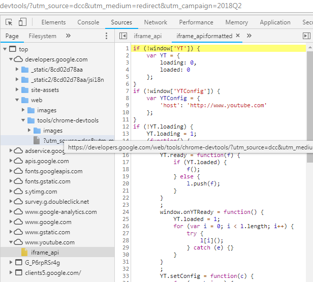

Chrome DevTools
================
Understanding how to use Chrome Developer Tools to inspect, trouble shoot, optimize web sites.

## Opening DevTools
- Menu -> More tools -> Developer tools
- Right+Click on page element -> inspect
- (Accel Key) Ctrl + Shift + I
- (Shortcut Key) F12 
## Overview of Capabilities
- Elements
    - Inspect and Edit HTML elements
    - We can use _'Select an element on page to inspect' (Ctrl + Shift + C)_ to highlight HTML for selected in the page!
- Console
    - Write JS code here, or see output from JS console here
    - Also see error messages
    - Note we have programatic access to the running DOM and JS environment from here. e.g.
    ```javascript
    > document.getElementByTagName('p');
    ```  
    _This will return an array of HTML elements with the paragraph tag_.  
    We can even write multiline snippets of code using _'Shift+Enter'_
- Sources
    - View the source code (& assets) on the server side
    - An example might look like -
      
    - Use the '{}' _prettify_ button to make minified source readable
- Network
    - Shows all the network requests with the details such as _Resource Name_, _HTTP Status_, _Size_, _Initiator of request_, _Waterfall View_ etc.
    - This is very helpful for identifying network related performance issues
- Performance
    - 
